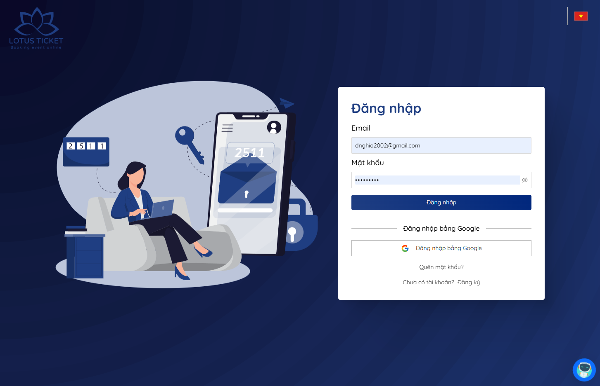
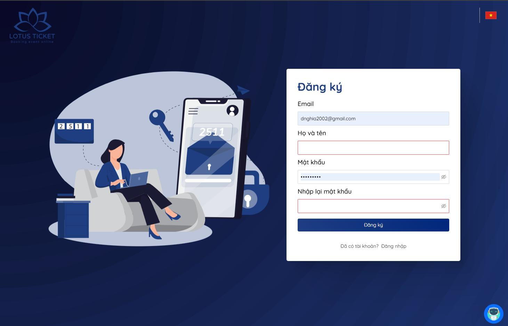
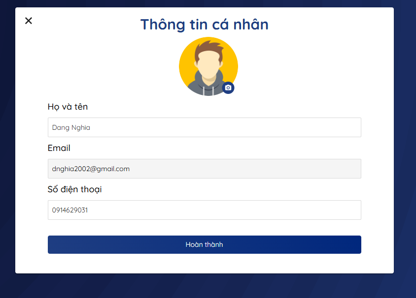

# Lotus Ticket — Nền tảng đặt vé sự kiện trực tuyến

**Lotus Ticket** (tên repo: `booking-ticket`) là hệ thống đặt vé sự kiện full-stack, gồm cổng người dùng, bảng điều khiển quản trị/nhà tổ chức và REST API backend. Dự án hỗ trợ tìm kiếm sự kiện, đặt vé, thanh toán (PayPal & VNPay), đánh giá, chatbot AI và quản lý cho admin/nhà tổ chức.

---

## Mục lục

- [Tổng quan kiến trúc](#tổng-quan-kiến-trúc)
- [Tính năng chính](#tính-năng-chính)
- [Công nghệ sử dụng](#công-nghệ-sử-dụng)
- [Cấu trúc thư mục](#cấu-trúc-thư-mục)
- [Yêu cầu hệ thống](#yêu-cầu-hệ-thống)
- [Hướng dẫn cài đặt & chạy](#hướng-dẫn-cài-đặt--chạy)
- [Cấu hình môi trường](#cấu-hình-môi-trường)
- [Vai trò người dùng](#vai-trò-người-dùng)
- [API & tài liệu](#api--tài-liệu)
- [Ảnh chụp màn hình](#ảnh-chụp-màn-hình)
- [Triển khai](#triển-khai)
- [Ghi chú bổ sung](#ghi-chú-bổ-sung)

---

## Tổng quan kiến trúc

```
┌─────────────────────┐     ┌─────────────────────┐
│   User Console      │     │   Admin Console     │
│   (React, :3000)    │     │   (React, :3001)    │
└──────────┬──────────┘     └──────────┬──────────┘
           │                           │
           └───────────┬───────────────┘
                       │  REST API / OAuth2
           ┌───────────▼───────────────┐
           │   Spring Boot Backend     │
           │   (Java 11, :8080)        │
           └───────────┬───────────────┘
                       │
      ┌────────────────┼────────────────┐
      │                │                │
  MongoDB          Cloudinary      PayPal / VNPay
                   (ảnh)           OpenAI (chatbot)
```

| Thành phần | Mô tả |
|---|---|
| **User Console** | Giao diện công khai cho khách hàng: xem sự kiện, đặt vé, thanh toán, hồ sơ cá nhân |
| **Admin Console** | Bảng điều khiển cho Admin và Nhà tổ chức (Organizer) |
| **Backend API** | Spring Boot REST API, xác thực JWT + OAuth2 Google |
| **MongoDB** | Cơ sở dữ liệu chính |
| **Kafka Demo** | Module thử nghiệm gửi message qua Kafka (tách biệt, không bắt buộc) |

---

## Tính năng chính

### Khách hàng (Customer)
- Đăng ký / đăng nhập (email + mật khẩu hoặc Google OAuth)
- Quên mật khẩu qua OTP email
- Duyệt trang chủ, danh sách sự kiện, chi tiết sự kiện
- Tìm kiếm & lọc sự kiện theo tỉnh/thành, danh mục, thời gian
- Đặt vé, thanh toán qua **PayPal** hoặc **VNPay**
- Xem vé đã mua (QR code, xuất PDF)
- Wishlist sự kiện yêu thích
- Theo dõi nhà tổ chức
- Đánh giá sự kiện sau khi kết thúc
- Chatbot hỗ trợ (OpenAI fine-tuned)
- Đa ngôn ngữ (i18n)

### Nhà tổ chức (Organizer)
- Đăng ký tổ chức (chờ Admin duyệt)
- Tạo / chỉnh sửa sự kiện, upload ảnh nền (Cloudinary)
- Quản lý loại vé và số lượng
- Xem đơn hàng, danh sách khách hàng, người theo dõi
- Thống kê doanh thu & vé theo ngày/tuần/tháng/năm
- Lịch sự kiện (Calendar)
- Quản lý thanh toán

### Quản trị viên (Admin)
- Quản lý tài khoản người dùng
- Duyệt / từ chối đăng ký nhà tổ chức
- Quản lý danh mục sự kiện
- Xem trạng thái thanh toán toàn hệ thống
- Dashboard tổng quan

---

## Công nghệ sử dụng

### Backend
| Công nghệ | Phiên bản / Ghi chú |
|---|---|
| Java | 11 |
| Spring Boot | 2.7.3 |
| Spring Security + JWT | Xác thực & phân quyền |
| Spring OAuth2 Client | Đăng nhập Google |
| Spring Data MongoDB | Cơ sở dữ liệu |
| Spring Mail + FreeMarker | Gửi email (OTP, thông báo) |
| Swagger / Springfox | Tài liệu API |
| Cloudinary | Upload & lưu trữ ảnh |
| PayPal REST SDK | Thanh toán quốc tế |
| VNPay | Thanh toán nội địa |
| OpenAI API | Chatbot hỗ trợ |
| Lombok | Giảm boilerplate |
| Cucumber | BDD testing (demo) |

### Frontend — User Console
| Công nghệ | Ghi chú |
|---|---|
| React 17 | UI chính |
| Redux Toolkit + Redux Persist | State management |
| React Query (TanStack) | Data fetching & cache |
| React Router v6 | Định tuyến |
| Material UI + Ant Design + Bootstrap | UI components |
| Formik + Yup | Form validation |
| i18next | Đa ngôn ngữ |
| Axios | HTTP client |
| jsPDF + QR Code | Xuất vé |
| Socket.io / STOMP | Real-time (client-side) |
| Sass + Tailwind CSS | Styling |
| Netlify | Deploy production |

### Frontend — Admin Console
| Công nghệ | Ghi chú |
|---|---|
| React 17 | UI chính |
| Redux Toolkit + React Query | State & data |
| Ant Design + MUI + Syncfusion | UI components |
| Chart.js | Biểu đồ thống kê |
| React Quill / Draft.js | Rich text editor |
| ExcelJS | Xuất Excel |
| Sass + Tailwind CSS | Styling |

---

## Cấu trúc thư mục

```
booking-ticket/
├── backend/
│   └── booking-event/
│       ├── booking-event/          # Spring Boot API chính
│       │   ├── src/main/java/com/nghia/bookingevent/
│       │   │   ├── controllers/    # REST controllers
│       │   │   ├── services/       # Business logic
│       │   │   ├── models/         # MongoDB documents
│       │   │   ├── repository/     # Data access
│       │   │   ├── config/         # Security, CORS, Swagger, ...
│       │   │   ├── security/       # JWT, OAuth2
│       │   │   └── payload/        # Request/Response DTOs
│       │   ├── src/main/resources/
│       │   │   └── templates/      # Email templates (FreeMarker)
│       │   ├── pom.xml
│       │   └── build.sh
│       └── kafka-demo/             # Module demo Kafka (tùy chọn)
├── frontend/
│   ├── user-console/               # Cổng người dùng (port 3000)
│   └── admin-console/              # Bảng điều khiển Admin/Organizer (port 3001)
├── screenshot/                     # Ảnh chụp màn hình demo
└── README.md
```

---

## Yêu cầu hệ thống

- **Java 11+**
- **Maven 3.6+** (hoặc dùng `./mvnw` có sẵn trong project)
- **Node.js 16+** và **npm 8+**
- **MongoDB** (local hoặc MongoDB Atlas)
- Tài khoản dịch vụ bên thứ ba (tùy tính năng cần dùng):
  - Google OAuth (đăng nhập Google)
  - Cloudinary (upload ảnh)
  - PayPal Sandbox / VNPay Sandbox (thanh toán)
  - OpenAI API (chatbot)
  - Gmail App Password (gửi email OTP)

---

## Hướng dẫn cài đặt & chạy

### 1. Clone repository

```bash
git clone https://github.com/DangNghia17/booking-ticket.git
cd booking-ticket
```

### 2. Cấu hình Backend

Tạo file `backend/booking-event/booking-event/src/main/resources/application.properties` (file này bị gitignore, không commit lên repo):

```properties
# Server
server.port=8080

# MongoDB
spring.data.mongodb.uri=mongodb://localhost:27017/lotus_ticket

# JWT
app.jwtSecret=your-jwt-secret-key-here
app.jwtExpirationInMs=864000000

# CORS (phân tách bằng dấu phẩy)
allowed.origins=http://localhost:3000,http://localhost:3001

# Google OAuth2
spring.security.oauth2.client.registration.google.client-id=YOUR_GOOGLE_CLIENT_ID
spring.security.oauth2.client.registration.google.client-secret=YOUR_GOOGLE_CLIENT_SECRET
spring.security.oauth2.client.registration.google.scope=email,profile

# PayPal
paypal.client.app=YOUR_PAYPAL_CLIENT_ID
paypal.client.secret=YOUR_PAYPAL_CLIENT_SECRET
paypal.mode=sandbox

# VNPay
vnpay.tmn_code=YOUR_VNPAY_TMN_CODE
vnpay.hash_secret=YOUR_VNPAY_HASH_SECRET
vnpay.api.url=https://sandbox.vnpayment.vn/paymentv2/vpcpay.html

# Payment redirect URLs
app.payment.redirect-url=http://localhost:3000/payment/redirect
app.payment.success-url=http://localhost:3000/payment/redirect?status=success
app.payment.cancel-url=http://localhost:3000/payment/redirect?status=cancel

# OpenAI (Chatbot)
openai.api.key=YOUR_OPENAI_API_KEY
```

> **Lưu ý:** Cấu hình email SMTP hiện nằm trong `MailConfig.java`. Nên chuyển sang biến môi trường hoặc `application.properties` trước khi deploy production.

Chạy backend:

```bash
cd backend/booking-event/booking-event
chmod +x mvnw
./mvnw spring-boot:run
```

Hoặc build JAR:

```bash
./mvnw clean install -DskipTests
java -jar target/booking-event-0.0.1-SNAPSHOT.jar
```

API chạy tại: `http://localhost:8080`

### 3. Cấu hình & chạy User Console

Tạo file `frontend/user-console/.env`:

```env
REACT_APP_API_URL=http://localhost:8080
REACT_APP_GOOGLE_CLIENT_ID=YOUR_GOOGLE_CLIENT_ID
REACT_APP_ENV=development
```

```bash
cd frontend/user-console
npm install
npm start
```

Ứng dụng chạy tại: `http://localhost:3000`

### 4. Cấu hình & chạy Admin Console

Tạo file `frontend/admin-console/.env`:

```env
REACT_APP_API_URL=http://localhost:8080
REACT_APP_ENV=development
```

```bash
cd frontend/admin-console
npm install
npm start
```

Ứng dụng chạy tại: `http://localhost:3001`

---

## Cấu hình môi trường

### Backend (`application.properties`)

| Biến | Mô tả |
|---|---|
| `spring.data.mongodb.uri` | Connection string MongoDB |
| `app.jwtSecret` | Secret key ký JWT |
| `app.jwtExpirationInMs` | Thời gian hết hạn token (ms) |
| `allowed.origins` | Danh sách origin được phép CORS |
| `spring.security.oauth2.client.registration.google.*` | Cấu hình Google OAuth2 |
| `paypal.client.app` / `paypal.client.secret` / `paypal.mode` | Cấu hình PayPal |
| `vnpay.tmn_code` / `vnpay.hash_secret` / `vnpay.api.url` | Cấu hình VNPay |
| `app.payment.redirect-url` | URL redirect sau thanh toán |
| `openai.api.key` | API key OpenAI cho chatbot |

### Frontend (`.env`)

| Biến | Mô tả |
|---|---|
| `REACT_APP_API_URL` | URL backend API (ví dụ: `http://localhost:8080`) |
| `REACT_APP_GOOGLE_CLIENT_ID` | Google Client ID (chỉ User Console) |
| `REACT_APP_ENV` | Môi trường (`development` / `production`) |

---

## Vai trò người dùng

| Vai trò | Mã quyền | Mô tả |
|---|---|---|
| Khách hàng | `ROLE_USER` | Đặt vé, quản lý hồ sơ, wishlist |
| Nhà tổ chức | `ROLE_ORGANIZATION` | Tạo sự kiện, quản lý vé & đơn hàng |
| Quản trị viên | `ROLE_ADMIN` | Quản lý toàn hệ thống, duyệt tổ chức |

---

## API & tài liệu

Sau khi backend chạy, truy cập Swagger UI:

- **Swagger UI:** `http://localhost:8080/swagger-ui.html`
- **API Docs:** `http://localhost:8080/v2/api-docs`

### Nhóm API chính

| Prefix | Mô tả |
|---|---|
| `/api/auth/*` | Đăng ký, đăng nhập, quên mật khẩu, OTP |
| `/api/event/*` | CRUD & tìm kiếm sự kiện |
| `/api/customer/*` | Đơn hàng, wishlist, theo dõi organizer |
| `/api/organization/*` | Quản lý sự kiện, vé, thống kê (Organizer) |
| `/api/admin/*` | Quản trị hệ thống (Admin) |
| `/api/payment/*` | PayPal & VNPay |
| `/api/review/*` | Đánh giá sự kiện |
| `/api/chat/*` | Chatbot AI |
| `/oauth2/authorization/google` | Đăng nhập Google OAuth2 |

### Collections MongoDB

| Collection | Mô tả |
|---|---|
| `account` | Tài khoản người dùng |
| `admin` | Tài khoản admin |
| `customer` | Thông tin khách hàng |
| `organization` | Thông tin nhà tổ chức |
| `event` | Sự kiện |
| `event_category` | Danh mục sự kiện |
| `order` | Đơn đặt vé |
| `review` | Đánh giá |
| `chat_messages` / `chat_sessions` | Lịch sử chatbot |
| `statistics` | Thống kê |
| `roles` | Vai trò |

---

## Ảnh chụp màn hình

### Trang công khai

| | |
|---|---|
| Trang chủ |  |
| Danh sách sự kiện |  |
| Chi tiết sự kiện |  |
| Đăng ký nhà tổ chức |  |

### Chưa đăng nhập

| | |
|---|---|
| Đăng nhập |  |
| Đăng ký |  |
| Quên mật khẩu |  |

### Khách hàng (đã đăng nhập)

| | |
|---|---|
| Đặt vé |  |
| Hồ sơ |  |
| Đổi mật khẩu |  |

### Nhà tổ chức (đã đăng nhập)

| | |
|---|---|
| Dashboard quản lý sự kiện |  |
| Tạo / cập nhật sự kiện |  |
| Hồ sơ |  |
| Đổi mật khẩu |  |

---

## Triển khai

### User Console — Netlify

Project đã cấu hình sẵn `frontend/user-console/netlify.toml`:

```bash
cd frontend/user-console
npm run build
npm run deploy   # netlify deploy --prod
```

### Backend — Heroku / VPS

Script build cho môi trường deploy:

```bash
cd backend/booking-event/booking-event
chmod +x build.sh
./build.sh
```

File `system.properties` chỉ định Java 11 cho Heroku.

---

## Ghi chú bổ sung

- **Kafka Demo:** Module `backend/booking-event/kafka-demo` là phần thử nghiệm gửi message qua Kafka, tách biệt với API chính. Cần cài đặt Kafka broker riêng nếu muốn chạy.
- **Bảo mật:** Không commit `application.properties`, `.env` hoặc API keys lên Git. Các secret hiện hardcode trong source (MailConfig, CloudinaryConfig) nên được chuyển sang biến môi trường trước khi public/deploy.
- **Tests:** Backend dùng Cucumber BDD (`src/test/resources/features/`). Maven được cấu hình `skipTests=true` mặc định khi build.
- **Liên hệ:** lotusticket.vn@gmail.com

---

## License

Dự án cá nhân / học tập. Vui lòng liên hệ tác giả trước khi sử dụng cho mục đích thương mại.
